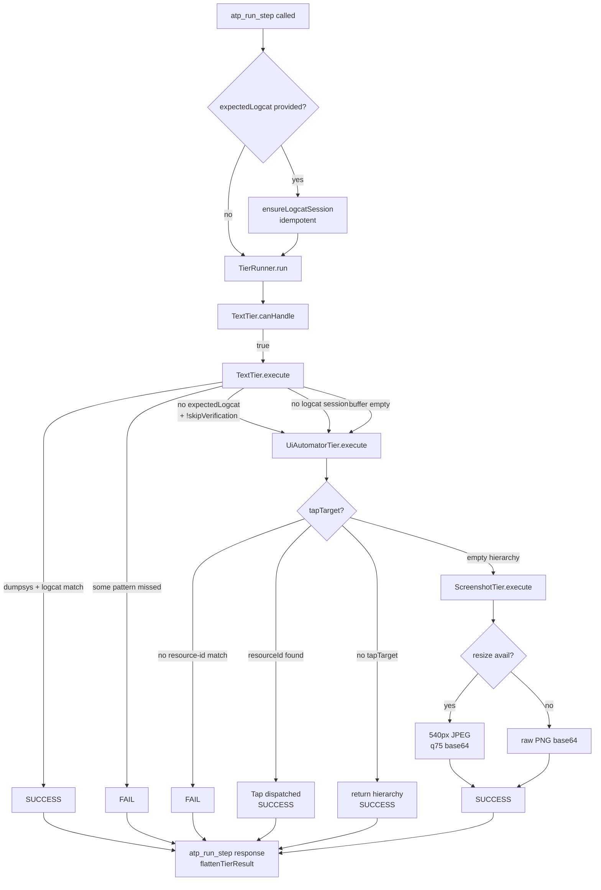

# Architecture

High-level diagram of what happens during a single `atp_run_step` call.



## Tier contracts

| Tier | canHandle | Can verify? | Can act (tap)? | Typical cost |
|------|-----------|-------------|---------------|--------------|
| TextTier | always (device reachable) | yes, via logcat pattern match | no | 1-2 dumpsys + 1 logcat scan |
| UiAutomatorTier | always (device reachable) | weak (element presence) | yes (resource-id or coords) | 1 uiautomator dump |
| ScreenshotTier | always | only via LLM vision | no | 1 screencap + resize |

## Result discriminated union

`TierResult` is a discriminated union keyed by `status`:

- `SUCCESS` — observation/verification/rawData optional
- `FAIL` — `verification` required
- `FALLBACK` — `fallbackHint` required; runner advances to the next tier
- `ERROR` — `error` required; runner short-circuits

The MCP server flattens this back to a plain object via `flattenTierResult`
so the wire format stays simple for the caller.

## Logcat session lifecycle

```
atp_run_step(expectedLogcat=[...]) ──► ensureLogcatSession()
                                         │
                                         ├─► existing && not expired  → reuse
                                         └─► start new (MAX_SESSIONS_PER_DEVICE=3)
```

Sessions are capped per device (3) and globally (50) to prevent fd/memory
exhaustion. Buffer is capped at 50k lines AND 64MB; overflow is reported via
`stopLogcat().bytesDropped`.

Lines returned by `atp_logcat_read` pass through a redaction filter that
strips bearer tokens, credentials, emails, and card-shaped digit strings
before they reach the agent context. Opt out with
`MOBILEMCP_DISABLE_REDACTION=1`.

## Shutdown

SIGTERM / SIGINT trigger a graceful drain — each child `adb logcat` process
gets SIGTERM then we await its `exit` event (bounded 2s per child) so the
last seconds of log output are flushed before `process.exit(0)`.
